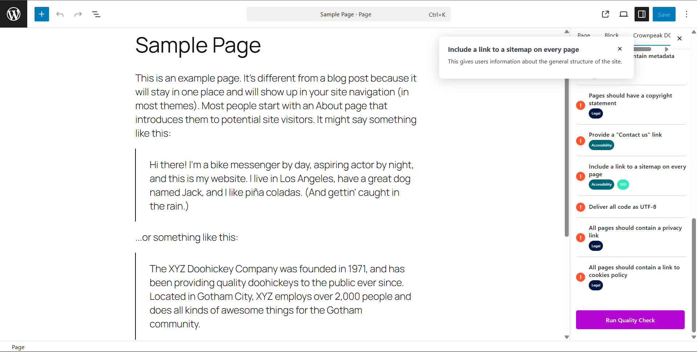

<a href="http://www.crownpeak.com" target="_blank"></a>

# Crownpeak DQM WordPress Plugin
This plugin integrates [Crownpeak DQM](https://www.crownpeak.com/products/digital-quality-management) into the WordPress Gutenberg editor, providing real-time insights into content quality, accessibility, SEO, and compliance as you build pages.

---

## 🚀 Features

- Live scanning and checkpoint validation inside the Gutenberg editor
- DQM topic and issue visibility
- Accessible UI components styled for seamless WordPress integration

---

## 📦 Download and Installation

### Option 1: Upload via WordPress Admin (Recommended)

1. **Download ZIP**
    - [Click here to download the latest release](https://github.com/crownpeak/dqm-wordpress-plugin/releases/latest)

2. **Upload to WordPress**
    - Navigate to your WordPress Admin panel
    - Go to **Plugins → Add New → Upload Plugin**
    - Select the downloaded `.zip` file and click **Install Now**

3. **Activate the Plugin**
    - After installation, click **Activate Plugin**

---

### Option 2: Install via Git Checkout (for Developers)

1. Clone this repository into your WordPress `plugins` directory:
   ```bash
   git clone https://github.com/crownpeak/dqm-wordpress-plugin.git wp-content/plugins/crownpeak-dqm-plugin
   ```

2. Activate the plugin in the WordPress Admin panel.

---

## 📁 Plugin Structure

```
crownpeak-dqm-plugin/
├── dqm-wordpress-plugin.php       # Main plugin logic
├── crownpeak-dqm-gutenberg.js     # Gutenberg JS integration
└── crownpeak-dqm-gutenberg.css    # Admin styles
```

## 📸 Screenshots
1. Gutenberg sidebar with checkpoint results


2. Modal displaying topic insights


3. Plugin admin screen


4. Admin settings panel


---

## 🧩 Compatibility

- WordPress 6.0+
- Gutenberg Editor (required)

---

###   Support
* This repository is managed by Crownpeak under the terms of the MIT License.
* The Crownpeak platform is managed by Crownpeak under the terms of each customer agreement.

##  Legal Notices
Crownpeak DQM WordPress Plugin is an example solution subject to the [MIT license](./LICENSE).

This data connector must not be used for any illegal activities or in ways that could harm Crownpeak or Fredhopper's systems.

Copyright © 2025 Crownpeak Technology, Inc. All rights reserved. Fredhopper is a trademark of Crownpeak Technology, Inc.

## Disclaimer
This document is provided for information purposes only. Crownpeak may change the contents hereof without notice. This document is not warranted to be error-free, nor subject to any other warranties or conditions, whether expressed orally or implied in law, including implied warranties and conditions of merchantability or fitness for a particular purpose. Crownpeak specifically disclaims any liability with respect to this document and no contractual obligations are formed either directly or indirectly by this document. The technologies, functionality, services, and processes described herein are subject to change without notice.